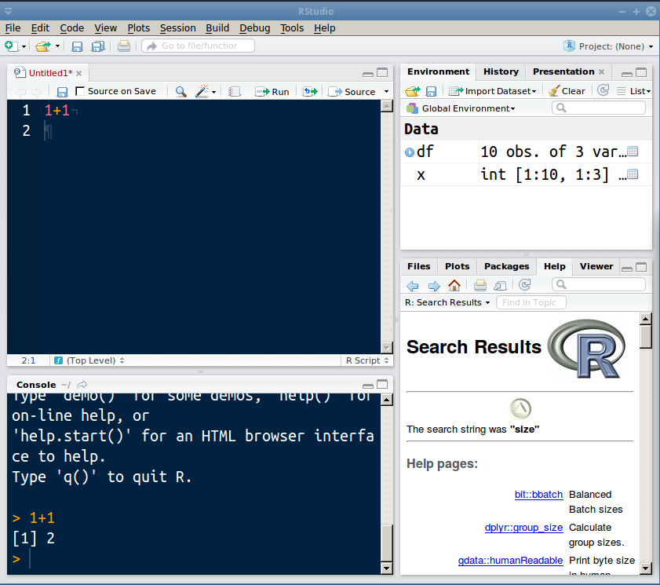
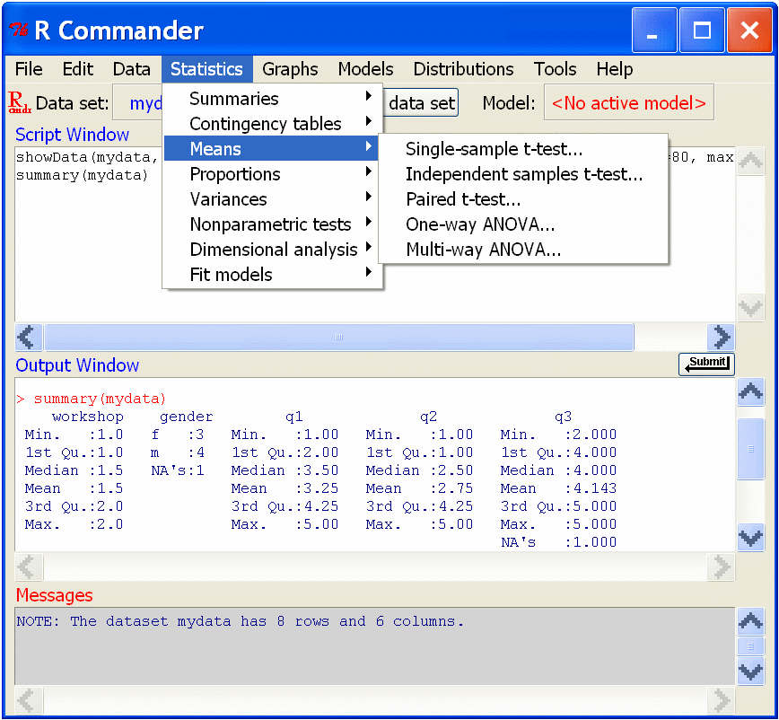
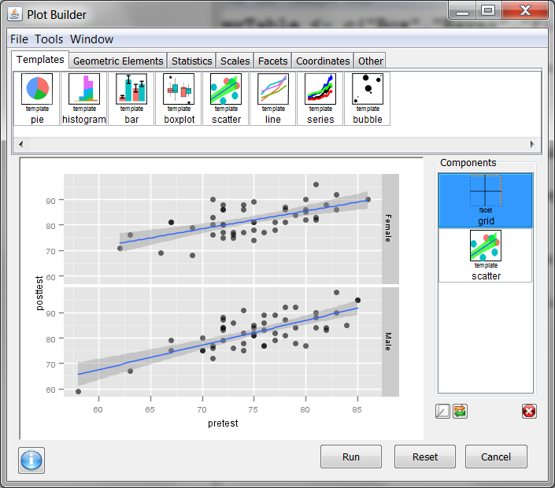
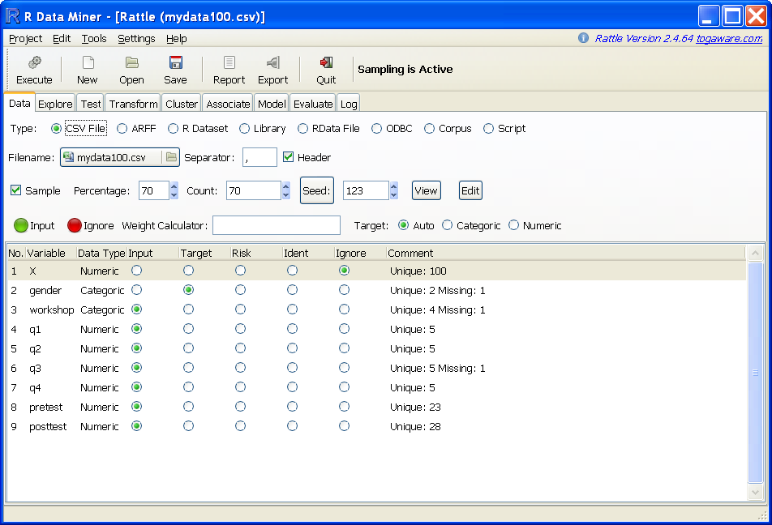
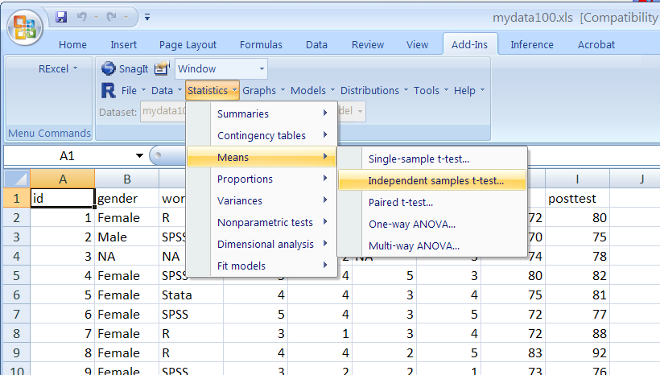

## Contents

* What is R?
* R Extensions
* R Interfaces
* R Resources


# What is R?

## What is R?

* Powerful, free, open source.
* Part programming language, part data analysis package.
* An implementation of the S language.
* Written by Ross Ihaka & Robert Gentleman.
* SAS/SPSS have <15 add-ons, R has over 6400!
* Most popular environment for developing new analysis and vis methods.


## The SAS/SPSS Way

1. Data input and management
2. Stats and graphics procedures
3. Output management systems
4. Macro language
5. Matrix language


## The R Way

All of these concepts are built into the (single) core language.


## Comparing R to Other Tools

* R can be harder to "get going" than other analysis tools.
* But once you do...
* Hastily becoming the "lingua franca".


# R Extensions

## Extensions

* Community and commercial addons.
* Everything from sophisticated analyses to making your computer beep.
* Written in R, Fortran, C, C++ mostly.
* Performance can sometimes be an issue, but generally accurate.
* Package download trends:  https://dgrtwo.shinyapps.io/cranview/

## The CRAN

* Comprehensive R Archive Network.
* Open source only.
* Over 6400 packages.
* High standard of quality is vigorously enforced.
* Closest thing to a journal for stats software.

```r
install.packages("NameOfPackage")
```

## GitHub

* Many authors eschewing CRAN for GitHub.
* Faster bug fixes, faster bugs (maybe).

```r
install.packages("devtools")
library(devtools)
install_github("GitHubUserName/RepositoryName")
```


# R Interfaces

## R Interfaces

1. RStudio
2. R Commander
3. Deducer
4. Rattle
5. R from Excel
6. Shiny


## RStudio


## R Commander


## Deducer


## Rattle


## R from Excel
http://rcom.univie.ac.at/download.html


## Shiny

* System for creating your own gui's (webapp)
* Code is 100% R (but can use html/css/javascript/...)
* Community quickly getting flooded with webapps


## Shiny: Plot Your Data

[Live](https://pharmacometrics.shinyapps.io/ggplotmydata/ggplotwithyourdata.Rmd) [Source code](https://github.com/isop-phmx/GGplot-Shiny)


## Shiny: Radiant

[Live](http://vnijs.rady.ucsd.edu:3838/marketing) [Source code](https://github.com/vnijs/radiant)


# R Resources

## Books
* *The Art of R Programming*, Norm Matloff
* *R for SAS and SPSS Users*, Muenchen
* *R for Stata Users*, Muenchen & Hilbe
* [*An Introduction to R*](http://cran.r-project.org/doc/manuals/R-intro.pdf)
* [*The R Inferno*](http://www.burns-stat.com/pages/Tutor/R_inferno.pdf)

## Comparisons to Other Languages
* [aRrgh: a newcomer’s (angry) guide to R](http://tim-smith.us/arrgh/)
* [Mathesaurus](http://mathesaurus.sourceforge.net/)
* [R programming for those coming from other languages](http://www.johndcook.com/R_language_for_programmers.html)


## Online Help

* `[r]` tag on stackoverflow
* The mailing lists (r-help)
* `#rstats` on twitter


## Questions?

This presentation is available at [github.com/wrathematics/2015SFSURworkshop](https://github.com/wrathematics/2015SFSURworkshop)

Exercises are also available there.