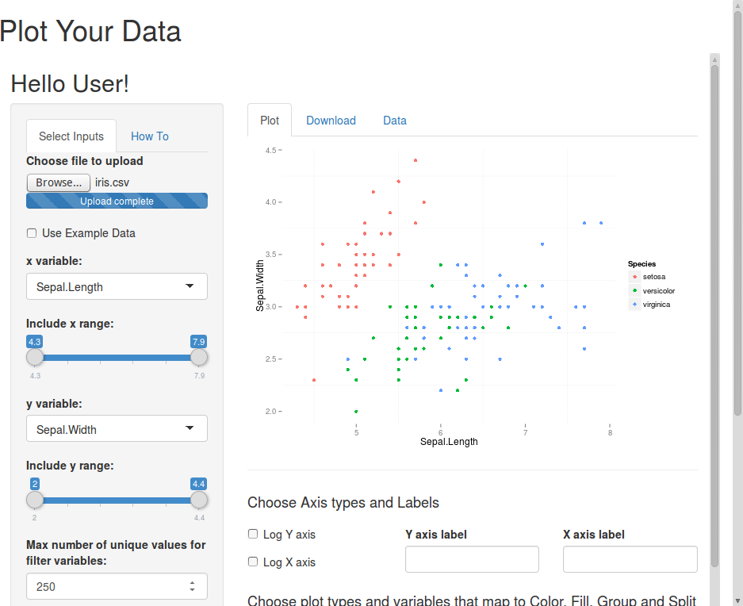
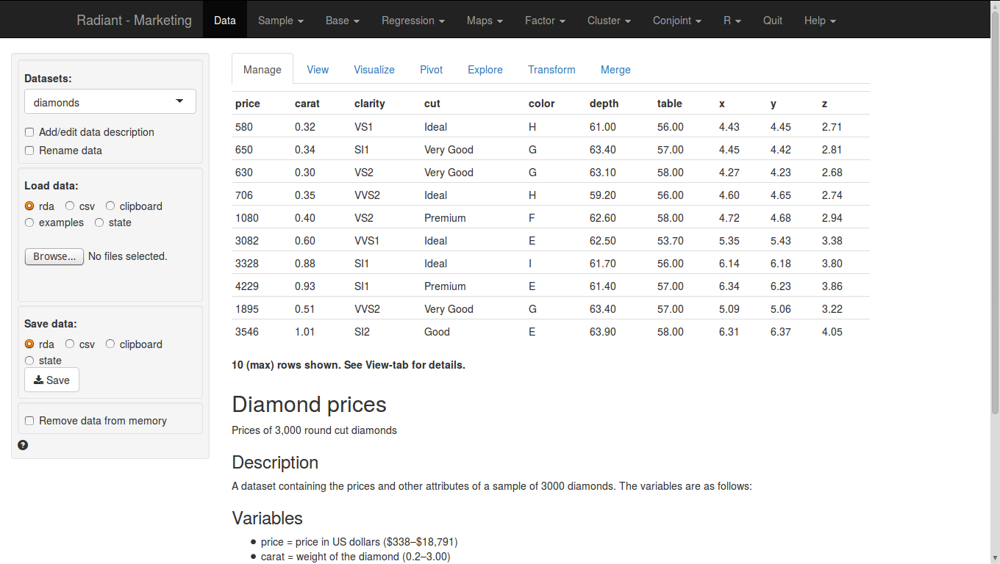

## Contents

# What is R?

## What is R?

* A powerful, free, open source language and package for graphics and data analysis 
* An implementation of the S language
* Written by Ross Ihaka & Robert Gentleman
* SAS/SPSS have <15 add-ons, R has over 5,200!
* #1 language for developing new data analysis and graphical methods

# The R Way

## The SAS/SPSS Way

1. Data input and management
2. Stats and graphics procedures
3. Output management systems
4. Macro language
5. Matrix language

## The R Way

# R and R Extensions

# R Interfaces

## R Interfaces

1. RStudio
2. R Commander
3. Deducer
4. Rattle
5. R from Excel
6. Shiny

## Shiny

* System for creating your own gui's (webapp)
* Code is 100% R (but can use html/css/javascript/...)
* Community quickly getting flooded with webapps

## Shiny: Plot Your Data

[Live](https://pharmacometrics.shinyapps.io/ggplotmydata/ggplotwithyourdata.Rmd) [Source code](https://github.com/isop-phmx/GGplot-Shiny)

## Shiny: Radiant

[Live](http://vnijs.rady.ucsd.edu:3838/marketing) [Source code](https://github.com/vnijs/radiant)

## R Resources

#### Books
* *The Art of R Programming*, Norm Matloff
* *R for SAS and SPSS Users*, Muenchen
* *R for Stata Users*, Muenchen & Hilbe
* [*An Introduction to R*](http://cran.r-project.org/doc/manuals/R-intro.pdf)
* [*The R Inferno*](http://www.burns-stat.com/pages/Tutor/R_inferno.pdf)

#### Comparisons to Other Languages
* [aRrgh: a newcomer’s (angry) guide to R](http://tim-smith.us/arrgh/)
* [Mathesaurus](http://mathesaurus.sourceforge.net/)
* [R programming for those coming from other languages](http://www.johndcook.com/R_language_for_programmers.html)

## Questions?

This presentation is available at [github.com/wrathematics/2015SFSURworkshop](https://github.com/wrathematics/2015SFSURworkshop)

Exercises are also available there.