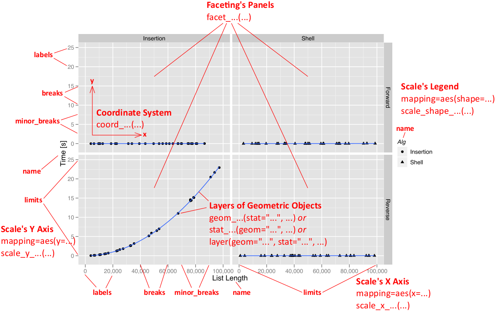

## Contents

* Plotting Data in R
* Introduction to ggplot2
* Deconstructing a ggplot2 Plot
* Using ggplot2
* Advanced Features and Tweaks
* Wrapup


# Plotting Data in R

## Some Options

* Base graphics
* Grid
* Lattice
* ggplot2
* And [about 40 other packages](http://cran.r-project.org/web/views/Graphics.html)

```{r, echo=TRUE, eval=TRUE}
df <- data.frame(x=1:10, y=rnorm(10))
head(df)
```

## Base Graphics

Makes easy things easy, and hard things impossible.

```{r, echo=TRUE, eval=TRUE}
plot(df$x, df$y)
```


## Grid

"Assembly language" for graphics.


## Lattice

A powerful system for producing graphics, 

```{r, echo=TRUE, eval=TRUE}
library(lattice)
xyplot(y~x, df)
```

## ggplot2

Powerful and flexible; a darling of the R community.

```{r, echo=TRUE, eval=TRUE}
library(ggplot2)

ggplot(df, aes(x, y)) + geom_point()
```


# Introduction to ggplot2

## Ways of Plotting

* `qplot()` --- Shorthand
* Layer syntax --- Extremely rare "in the wild".
* geom/stat syntax --- Most popular method.
* autoplot --- Methods (as in OO) for plotting objects.


## General Procedure

* Put your data into a dataframe.
* Declare which dataframe ggplot should use and set aesthetics.
* Add layers via geom/stat functions.
* Set options, faceting, labels, titles, ...


## ?????

Geoms?  Aesthetics?  Facets?


# Deconstructing a ggplot2 Plot

## 4 Components

1. Geoms --- physical components (point, line, path, polygon)
2. Aesthetics --- visual cues (size, rotation, thickness, gradient, shape, color)
3. Coordinates
4. Faceting --- copolotting (more on this later)


## Customization Nearly Unlimited




## Geom/Stat Functions


```{r, eval=TRUE, echo=FALSE, results='asis'}
formatter <- function(obj)
{
  i <- 1
  for (nm in obj)
  {
    cat(nm, " ")
    if (i == 4)
    {
      i <- 1
      cat("\n")
    }
  }
}
obj <- objects(getNamespace("ggplot2"))

geoms <- obj[grep(obj, pattern="^geom_")]
formatter(geoms)
cat("\n\n")
stats <- obj[grep(obj, pattern="^stat_")]
formatter(stats)
```

For explanations and examples other than those provided here, see
the ggplot2 reference manual http://had.co.nz/ggplot2/


## Layering

Adding layers is not necessarily commutative!

```r
g + geom_point() + geom_line()

g + geom_line() + geom_point()
```

```{r, message=FALSE, echo=FALSE, fig.width=10, fig.height=4}
library(png)
library(grid)
img <- readPNG("./pics/ggplot2/layereg.png")
grid.raster(img)
```


# Using ggplot2

## The Diamonds Dataset
```{r, echo=TRUE, eval=TRUE}
library(ggplot2)

data(diamonds)
head(diamonds)
nrow(diamonds)
```

## 
```{r}
summary(diamonds)
```

## Barplot
```{r}
ggplot(data=diamonds, aes(x=clarity) ) + geom_bar()
```

## Barplot
```{r}
ggplot(data=diamonds, aes(x=clarity, fill=color) ) + geom_bar()
```

## Pie Chart
```{r}
ggplot(data=diamonds, aes(x=factor(1), fill=color) ) + 
  geom_bar(width=1) +
  coord_polar(theta="y")
```

## Histogram
```{r}
ggplot(data=diamonds, aes(x=price) ) + geom_histogram()
```

## Scatterplots
```{r}
g <- ggplot(data=diamonds, aes(x=clarity, y=carat) )
g + geom_point()
```

## Scatterplot with jitter
```{r}
g + geom_jitter()
```

## Boxplot
```{r}
g + geom_boxplot()
```


# Advanced Features and Tweaks

## Faceting
```{r}
g <- ggplot(data=diamonds, aes(x=carat, y=price) ) + geom_point(aes(color=cut))
g
```

## Faceting
```{r}
g + facet_wrap(~ cut)
```

## Faceting
```{r}
g + facet_grid(~ cut)
```

## Options
```{r}
g + xlab("Carat") + ylab("Price") + ggtitle("Carat by Price") + 
  labs(color="Cut") + theme_bw()
```

## Saving Plots

```r
pdf("path/to/outfile.pdf")
myplot # or last_plot()
dev.off()
```

```r
ggsave("path/to/outfile.pdf", myplot)
```

See also:

```r
?pdf
?ggsave
```


## Faceting


# Wrapup

## Where to Learn More

* Reference Manual http://had.co.nz/ggplot2/
* CRAN page http://cran.r-project.org/web/packages/ggplot2/index.html
* Google Group https://groups.google.com/group/ggplot2
* `[ggplot2]` tag on stackoverflow
* Official Book http://ggplot2.org/book/ (available in print)


## Questions?

This presentation is available at [github.com/wrathematics/2015SFSURworkshop](https://github.com/wrathematics/2015SFSURworkshop)

Exercises are also available there.